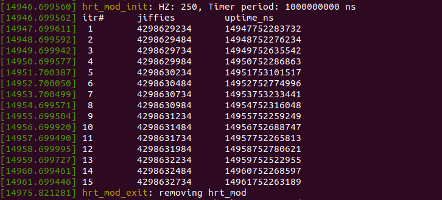

#### Notion of `HZ`
The kernel gets interrupted by the system timer at a fixed rate. This rate is defined by a constant ```HZ``` (that can be modified during compile time), and signifies the number of system timer interrupts in 1 sec. Thus the period between 2 successive timer interrupts is `1/HZ seconds`. 

Note that the value of HZ varies across different architectures, and can be checked with the following command
```
grep 'CONFIG_HZ' /boot/config-$(uname -r)
```

#### `jiffies`
`jiffies` is a global variable that stores the number of ticks/timer-interrupts occured since boot up. Its value is thus incremented by `HZ` every second.

#### `hrtimers`
High resolution timers were introduced in linux to support timers with resolution better than `1000/HZ milli-seconds`. These timers allow precise event scheduling and processing data.

The hrt_mod.c source code demonstrates the usage of the hrtimer API available in linux.

#### Directions to build the `hrt_mod` module
 1. I assume that your system has `subversion` installed. To download the `hrt_module` sub-directory, open a new terminal window, and execute:
```
$ svn export https://github.com/shahsharvil/Operating-System-Internals/trunk/hrtimer_module
```  
 2. Switch to **_root_** user and compile the source code with `make`.
```
# cd hrtimer_module
```
```
# make
```
 3. Insert the module into the kernel.
```
# insmod hrt_mod.ko
```
This will initialize and start the hrtimer with a default period of 1 second. The expiry time of timer is extended by this period everytime the timer expires. The number of times the timer is forwarded is controlled by the preprocessor directive `MAX_ITR`.
 
 4. The module can be removed from the kernel anytime after it is inserted using:
```
# rmmod hrt_mod.ko
```
#### Sample Output
The module prints information to the Kernel log files, which can be read with any of the commands below:
```
# dmesg
```
or
```
# tail -f /var/log/syslog
```

