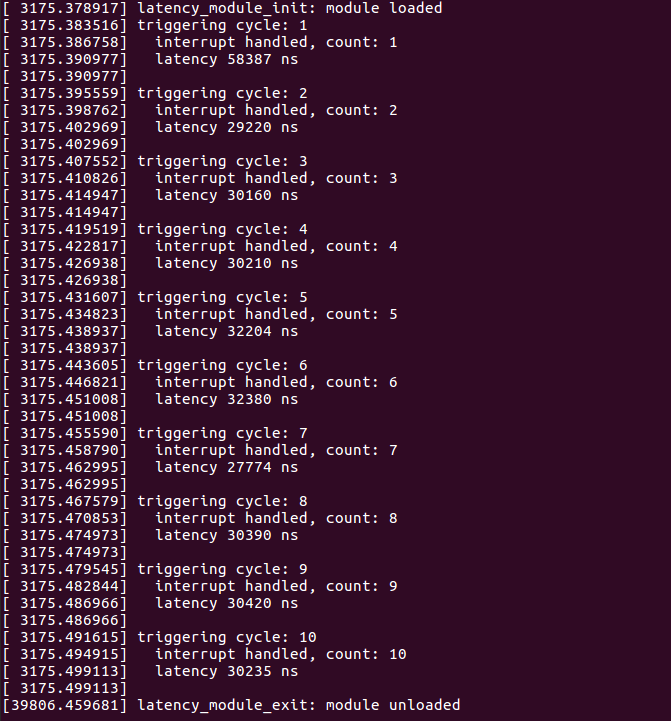

#### `Interrupt Latency`
Interrupt latency is defined as the amount of time required to service an interrupt signal.

#### The setup
The purpose of the source code is to measure interrupt latency of `Linux OS` for a single core CPU.

The `target` for this demonstration is Intel's `Galileo Gen-2` board. The following connections are needed:
 * Output of `GPIO2` pin is fed back to `GPIO3` using a jumper wire. 

#### Working
 * The module generates a square wave at `GPIO2`. This signal is fed back to `GPIO3` which is configured to act as an interrupt source. It generates an interrupt signal at the encounter of a rising edge.
 * The interrupt latency is calculated as the difference of:
    - time right before a square wave is generated at `GPIO2`
    - time when the ISR starts executing
 * This approach is not the best way to measure latencies, but it quite does the job.
 
#### Results
The test was performed on a single processor with no background processes.



 * The image above shows generation of `10` interrupt signals and their acknowledgements inside the ISR.
 
 * The latest interrupt latency is printed before generating the next sqaure wave cycle.
 
 * The latency values vary fairly averaging around `30 us`.
 
#### Directions to build the module
 1. I assume that your system has `subversion` installed. To download the `workqueue_demo` sub-directory, open a new terminal window, and execute:
```
$ svn export https://github.com/shahsharvil/Operating-System-Internals/trunk/interrupt_latency_linux
```  
 2. Switch to **_root_** user and compile the source code with `make`.
```
# cd interrupt_latency_linux
```
```
# make
```
This compiles the source code and makes the `workqueue_demo.ko` object file.
 
 3. You now need to copy the `.ko` file from `host (linux machine)` to `target (Intel Galileo)`. This can be done using secure copy (`scp`).
 ```
 scp workqueue_demo.ko app root@<target ip>:/home
 ```
  
 4. On your `target`, insert the `test_itr_latency.ko` module into the kernel.
```
# insmod test_itr_latency.ko
```

 5. The module can be removed from the kernel using:
```
# rmmod test_itr_latency.ko
```
 6. The module prints information to kernel log files, which can be read with:
```
# dmesg
```
