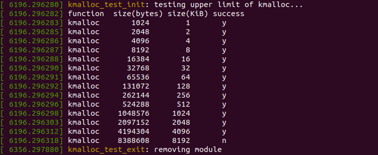

#### [kmalloc()](https://www.kernel.org/doc/htmldocs/kernel-api/API-kmalloc.html)
The kmalloc() function returns a pointer to a memory block (of atleast the `size` requested) that is physically contiguous. It is generally used to allocate memory for objects occupying memory less than the `PAGE_SIZE` of the kernel. (Large amounts of non-contiguous physical memory can be allocated using [vmalloc()](https://www.kernel.org/doc/htmldocs/kernel-api/API-vmalloc.html) instead.)

The standard `PAGE_SIZE` for the x86 architecture is 4096 bytes i.e 4 KiB. This can be checked from the terminal with the `getconf` command:
```
getconf PAGE_SIZE
```
The maximum amount of memory allocated using `kmalloc()` is dependent on the `PAGE_SIZE` of the kernel, and the `# of Buddy System Freelists`.

The `kmalloc_test` module checks this upper limit of kmalloc.

#### Directions to build the `kmalloc_test` module
 1. I assume that your system has `subversion` installed. To download the `kmalloc_upper_limit` sub-directory, open a new terminal window, and execute:
```
$ svn export https://github.com/shahsharvil/Operating-System-Internals/trunk/kmalloc_upper_limit
```  
 2. Switch to **_root_** user and compile the source code with `make`.
```
# cd kmalloc_upper_limit
```
```
# make
```
 3. Insert the module into the kernel.
```
# insmod kmalloc_test.ko
```
The init function of the module checks the maximum amount of RAM that can be allocated with a single call to kmalloc.
 
 4. The module can be removed from the kernel anytime after it is inserted using:
```
# rmmod kmalloc_test.ko
```
#### Sample Output
The module prints information to the Kernel log files, which can be read with any of the commands below:
```
# dmesg
```
or
```
# tail -f /var/log/syslog
```

