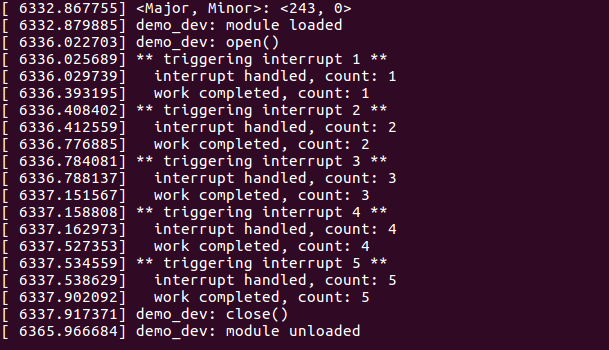
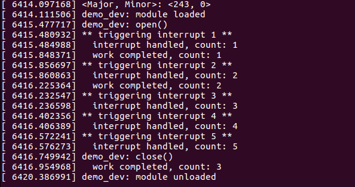

#### `Workqueueus`
Workqueues are one of the bottom-half mechanisms in linux that are used to defer `work` to a kernel thread. Since this work is handled by a kernel thread, it may sleep. Workqueues are in fact the only bottom-halves that do not run in interrupt context.

The linux workqueue API allows queueing `work` to a dedicated kernel thread, or spawning a special worker thread instead.  

#### The setup
The `target` for this demonstration is Intel's `Galileo Gen-2` board. The following connections are needed:
 * The output of `GPIO2` pin is fed back to `GPIO1` using a jumper wire. 
 * An `led` is connected between `GPIO5` and `GND`.

#### Working
 * When the application makes a `write` system call, the driver generates a square wave at `GPIO2`. This signal is fed back to `GPIO1` which is configured to act as an interrupt source. It generates an interrupt signal at the encounter of a rising edge.
 * The interrupt handler handles the interrupt signal and defers `work` to a driver-owned kernel thread. The work is to simply blink the led attached to `GPIO5`.
 * In a nutshell, the led is expected to blink whenever `GPIO1` generates an interrupt signal. However, we will see that this may not happen everytime.

#### Results
The driver module prints information to the Kernel log files, which can be read with:
```
# dmesg
```
The `expected` behavior:



 * The image above shows generation of `5` interrupt signals and their acknowledgements inside the ISR.
 
 * In addition, it details whether the deferred work was completed before the arrival of the next interrupt signal.

The `default` behavior:



 * Here, we can again see the generation and acknowledgements of those `5` interrupt signals. But the deferred `work` is completed only `3` times!

 * This is the default behavior of workqueues in linux, that the same work cannot be scheduled again.

 * In other words, if previously deferred work is not completed and the ISR tries to schedule `new work`, the `new work` gets **discarded**.

#### Directions to build the driver module
 1. I assume that your system has `subversion` installed. To download the `workqueue_demo` sub-directory, open a new terminal window, and execute:
```
$ svn export https://github.com/shahsharvil/Operating-System-Internals/trunk/linux_drivers/workqueue_demo
```  
 2. Switch to **_root_** user and compile the source code with `make`.
```
# cd workqueue_demo
```
```
# make
```
This compiles the source code and makes the `workqueue_demo.ko` object file as well as the `app` executable.
 
 3. You now need to copy both of these files from `host (linux machine)` to `target (Intel Galileo)`. This can be done using secure copy (`scp`).
 ```
 scp workqueue_demo.ko app root@<target ip>:/home
 ```
  
 4. On your `target`, insert the `workqueue_demo.ko` module into the kernel.
```
# insmod workqueue_demo.ko
```
 5. Run the `app` executable.
```
./app
```
 6. The module can be removed from the kernel using:
```
# rmmod workqueue_demo.ko
```
