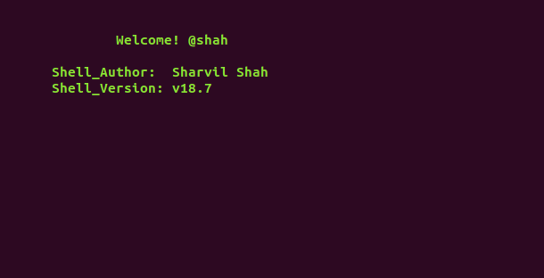
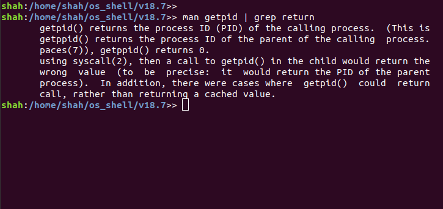
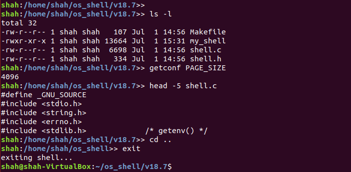

#### os_shell
A simple shell implemented in C.


#### Support
The `18.7` version of the shell supports the following functionalities.
Markup : 
* Explicity written `cd`, `clear`, `help` and `exit` functions.
* Supports running executables.
* Supports 1 layer of piping, example - man getpid | grep return

* This version of the shell uses `execvp` to run commands not explicitly written. This means that most commands available will work.

* Note: The shell currently does not support command history (using the `up` arrow key) and autofill (`TAB` key) options. 
#### Directions to make and run the `my_shell` executable.
 1. I assume that your system has `subversion` installed. To download the `kmalloc_upper_limit` sub-directory, open a new terminal window, and execute:
```
$ svn export https://github.com/shahsharvil/Operating-System-Internals/trunk/os_shell
```  
 2. Navigate to the `../os_shell/v18.7` directory.
 ```
 $ cd os_shell/v18.7
 ```
 3. The shell can be built with and without the `color' configuration. It should be noted that garbage values shall be printed to the console for terminals that don't support colors.
 ```
 $ make color
 ```
 or
 ```
 $ make
 ```
 4. Run the `my_shell` executable file
 ```
 ./my_shell
 ```
